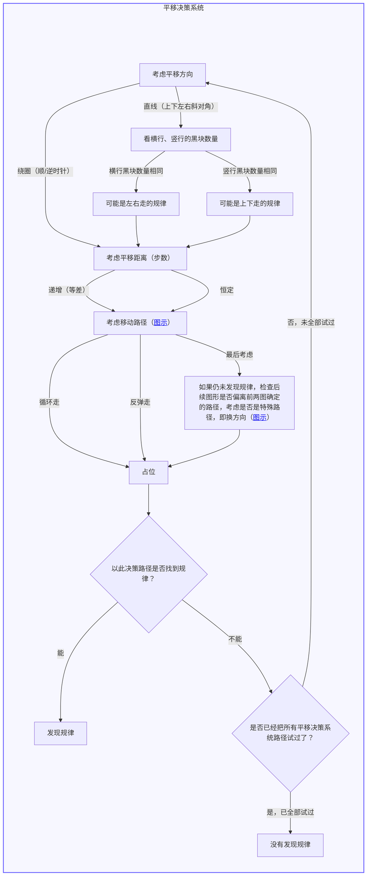

```mermaid
graph TD
    subgraph MOVE["<span style='color:#d14b4b;font-weight:700'>平移决策系统</span>"]
        direction TB
        MOVE_PAD[" "]
        MOVE_PAD ~~~ AE["考虑平移方向"]
        AE -->|直线（上下左右斜对角）| AA["看横行、竖行的黑块数量"]
        AE -->|绕圈（顺/逆时针）| AF["考虑平移距离（步数）"]
        AA -->|横行黑块数量相同| AB["可能是左右走的规律"]
        AA -->|竖行黑块数量相同| AC["可能是上下走的规律"]
        AB --> AF
        AC --> AF

        AG -->|循环走| MOVE_END["占位"]
        AG -->|反弹走| MOVE_END
        AG -->|最后考虑| AI["如果仍未发现规律，检查后续图形是否偏离前两图确定的路径，考虑是否是特殊路径，即换方向（<a href='../images/special-path-change-direction.png'>图示</a>）"]
        AF -->|递增（等差）| AG["考虑移动路径（<a href='../images/movement-path-cycle-rebound.png'>图示</a>）"]
        AF -->|恒定| AG
        AI --> MOVE_END

        MOVE_END --> AQ{"以此决策路径是否找到规律？"}
        AQ -->|能| AK["发现规律"]
        AQ -->|不能| AR{"是否已经把所有平移决策系统路径试过了？"}
        AR -->|否，未全部试过| AE
        AR -->|是，已全部试过| AS["没有发现规律"]
    end

    style MOVE fill:#f7f7ff,stroke:#6c63ff,stroke-width:2px
    style MOVE_PAD fill:transparent,stroke:transparent,color:transparent
```
