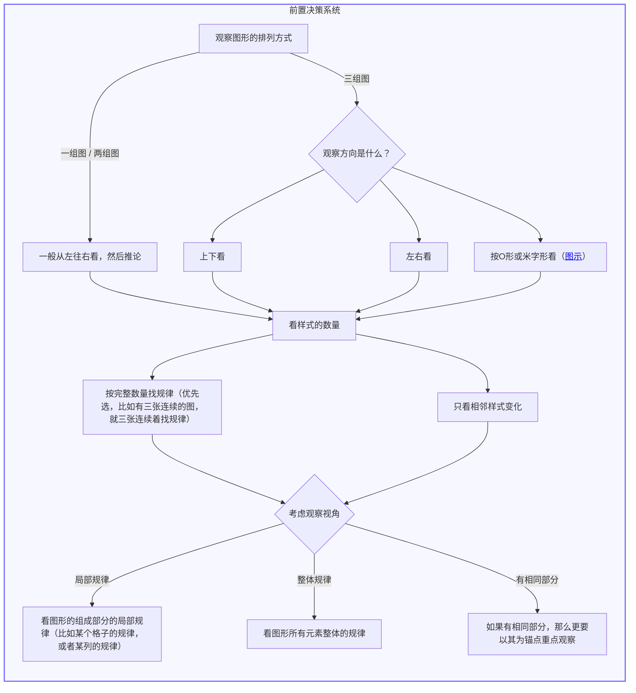

```mermaid
graph TD
    subgraph PRE["前置决策系统"]
        direction TB
        C["观察图形的排列方式"]
        C -->|一组图 / 两组图| D["一般从左往右看，然后推论"]
        C -->|三组图| E{"观察方向是什么？"}

        E --> F["上下看"]
        E --> G["左右看"]
        E --> H["按O形或米字形看（<a href='../images/figure-reasoning-paths.png'>图示</a>）"]

        D --> J["看样式的数量"]
        F --> J
        G --> J
        H --> J

        J --> M["按完整数量找规律（优先选，比如有三张连续的图，就三张连续着找规律）"]
        J --> N["只看相邻样式变化"]

        M --> O{"考虑观察视角"}
        N --> O
        O -->|局部规律| O1["看图形的组成部分的局部规律（比如某个格子的规律，或者某列的规律）"]
        O -->|整体规律| O2["看图形所有元素整体的规律"]
        O -->|有相同部分| O3["如果有相同部分，那么更要以其为锚点重点观察"]
    end

    style PRE fill:#f7f7ff,stroke:#6c63ff,stroke-width:2px
```
