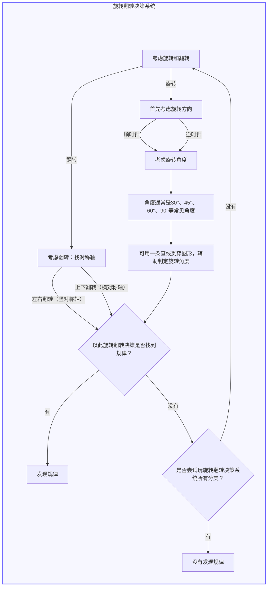

```mermaid
graph TD
    subgraph ROTATE["旋转翻转决策系统"]
        direction TB
        ROTATE_PAD[" "]
        ROTATE_PAD ~~~ U["考虑旋转和翻转"]

        U -->|翻转| BA["考虑翻转：找对称轴"]
        BA -->|左右翻转（竖对称轴）| ROTATE_RESULT
        BA -->|上下翻转（横对称轴）| ROTATE_RESULT
        U -->|旋转| BB["首先考虑旋转方向"]
        BB -->|顺时针| BC["考虑旋转角度"]
        BB -->|逆时针| BC
        BC --> BD["角度通常是30°、45°、60°、90°等常见角度"]
        BD --> BE["可用一条直线贯穿图形，辅助判定旋转角度"]
        BE --> ROTATE_RESULT

        ROTATE_RESULT{"以此旋转翻转决策是否找到规律？"}
        ROTATE_RESULT -->|有| ROTATE_FOUND["发现规律"]
        ROTATE_RESULT -->|没有| ROTATE_ALL{"是否尝试玩旋转翻转决策系统所有分支？"}
        ROTATE_ALL -->|没有| U
        ROTATE_ALL -->|有| ROTATE_NOT_FOUND["没有发现规律"]
    end

    style ROTATE fill:#f7f7ff,stroke:#6c63ff,stroke-width:2px
    style ROTATE_PAD fill:transparent,stroke:transparent,color:transparent
```
