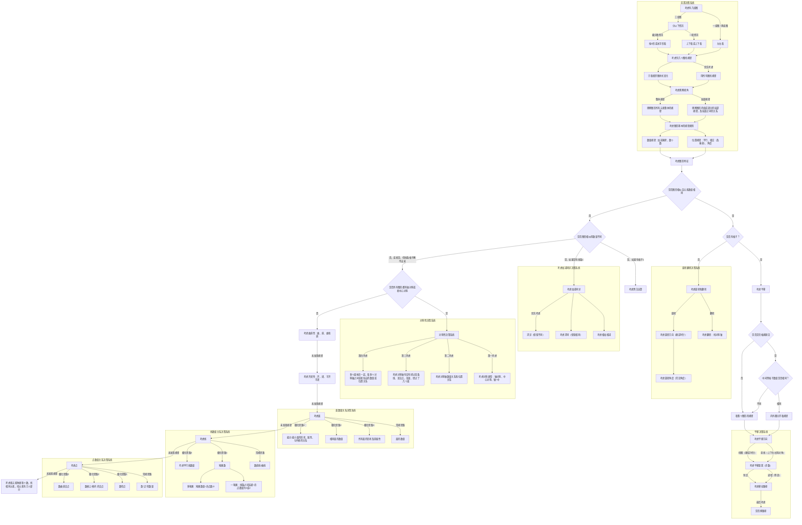

```mermaid
graph TB
    subgraph PRE["前置决策系统"]
        direction TB
        C["考虑有几组图"]
        D["左右看"]
        E["分以下情况"]
        F["上下看或上下看"]
        H["按O形或米字形看"]
        J["考虑凭几个图找规律"]
        M["用所有图找规律"]
        N["只看相邻图样式变化"]
        O["考虑观察视角"]
        O1["观察图形的组成部分的局部规律，及局部之间的关系"]
        O2["观察图形所有元素整体的规律"]
        N8["考虑图形基本的规律类别"]
        N9["位置规律：平行、相交（及垂直）、角度"]
        N10["数量规律：加减乘除、数个数"]
        C -->|一组图 / 两组图| D
        C -->|三组图| E
        E -->|一般情况| F
        E -->|极少数情况| H
        D --> J
        F --> J
        H --> J
        J -->|优先考虑| M
        J --> N
        M --> O
        N --> O
        O -->|局部规律| O1
        O -->|整体规律| O2
        O1 --> N8
        N8 --> N9
        N8 --> N10
        O2 --> N8
    end
    subgraph G1["旋转翻转决策系统"]
        direction TB
        U["考虑旋转和翻转"]
        BA["考虑翻转：找对称轴"]
        BB["考虑旋转方向（顺逆时针）"]
        BC["考虑旋转角度（常见角度）"]
        U -->|翻转| BA
        U -->|旋转| BB
        BB --> BC
    end
    subgraph G2["平移决策系统"]
        direction TB
        AE["考虑平移方向"]
        AF["考虑平移距离（步数）"]
        AG["考虑移动路径"]
        AI["是否换路径"]
        AE -->|直线（上下左右斜对角）| AF
        AE -->|绕圈（顺/逆时针）| AF
        AG -->|最后考虑| AI
        AF -->|递增（等差）| AG
        AF -->|恒定| AG
    end
    subgraph G3["考虑加减同异决策系统"]
        direction TB
        ADD_SUB["考虑加减同异"]
        N7["考虑相加相减"]
        N14["考虑求同（保留相同）"]
        N16["求异（保留不同）"]
        ADD_SUB --> N7
        ADD_SUB --> N14
        ADD_SUB -->|优先考虑| N16
    end
    subgraph G4["对称性决策系统"]
        direction TB
        N17["对称性决策系统"]
        N18["考虑对称类型：轴对称、中心对称、轴+中"]
        N22["考虑对称轴数量关系和位置关系"]
        N23["考虑对称轴有没有经过某条线、某交点，某面、经过了几个面"]
        N24["多个面挨在一起，看多个对称轴之间或者各自的数量或位置关系"]
        N17 -->|第一考虑| N18
        N17 -->|第二考虑| N22
        N17 -->|第三考虑| N23
        N17 -->|第四考虑| N24
    end
    subgraph G5["面数量关系决策系统"]
        direction TB
        N1["考虑面"]
        N12["面的数量"]
        N13["所有面的形状及其属性"]
        N4["相同面的数量"]
        N6["最大/最小面的形状、属性、与外框的关系"]
        N1 -->|常规思路| N12
        N1 -->|细化思路1:| N13
        N1 -->|细化思路2| N4
        N1 -->|细化思路3：| N6
    end
    subgraph G6["线数量关系决策系统"]
        direction TB
        N19["考虑线"]
        N20["数直线/曲线"]
        N21["笔画数"]
        N25["一笔画：线条之间连通+奇点数量为0或2"]
        N26["多笔画：笔画数量=奇点数/2"]
        N27["考虑平行线数量"]
        N19 -->|常规思路| N20
        N19 -->|细化思路1| N21
        N21 --> N25
        N21 --> N26
        N19 -->|细化思路2| N27
    end
    subgraph G7["点数量关系决策系统"]
        direction TB
        N28["考虑点"]
        N29["数“点”的数量"]
        N30["数切点"]
        N31["数框上/框内 的交点"]
        N32["数曲直交点"]
        N28 -->|常规思路| N29
        N28 -->|细化思路1| N30
        N28 -->|细化思路2| N31
        N28 -->|细化思路3| N32
    end
    AD["看整个图形的规律"]
    X{"中间黑格子数量是否相同？"}
    Y["内外圈分开看规律"]
    P0["考虑图形特征"]
    BLACK_WHITE["考虑黑白运算"]
    LINE_CHECK{"是否图形相似但数量不同"}
    S{"是否有格子？"}
    T["考虑平移"]
    V{"是否是宫格类题目"}
    N2{"是否图形相似且元素数量相同"}
    N15{"是否所有图形都有轴对称或者中心对称"}
    N3["考虑曲直性：曲、直、曲和直"]
    N5["考虑开闭性：开、闭、半开半闭"]
    N11["考虑素元素种类和个数，找相同元素，找元素有几个部分"]
    X -->|相同| Y
    X -->|不同| AD
    T --> V
    V -->|是| X
    V -->|否| AD
    N2 -->|是| S
    N2 -->|否| LINE_CHECK
    N15 -->|是| N17
    N15 -->|否| N3
    P0 --> N2
    S -->|是| T
    S -->|否| U
    Y --> AE
    AD --> AE
    LINE_CHECK -->|是，如果有格子1| BLACK_WHITE
    LINE_CHECK -->|是，如果是有线条1| ADD_SUB
    LINE_CHECK -->|否，或者是，但线条格子解不出来| N15
    N3 -->|未发现规律| N5
    N5 -->|未发现规律| N1
    N10 --> P0
    N9 --> P0
    N1 -->|未发现规律| N19
    N19 -->|未发现规律| N28
    N28 -->|未发现规律| N11
    %% mindtree-layout %7B%22version%22%3A1%2C%22nodes%22%3A%5B%7B%22id%22%3A%22C%22%2C%22x%22%3A2077%2C%22y%22%3A2658%2C%22layoutLocked%22%3Afalse%7D%2C%7B%22id%22%3A%22D%22%2C%22x%22%3A1940%2C%22y%22%3A2813%2C%22layoutLocked%22%3Afalse%7D%2C%7B%22id%22%3A%22E%22%2C%22x%22%3A2214%2C%22y%22%3A2813%2C%22layoutLocked%22%3Afalse%7D%2C%7B%22id%22%3A%22F%22%2C%22x%22%3A1934%2C%22y%22%3A2968%2C%22layoutLocked%22%3Afalse%7D%2C%7B%22id%22%3A%22H%22%2C%22x%22%3A2216%2C%22y%22%3A2968%2C%22layoutLocked%22%3Afalse%7D%2C%7B%22id%22%3A%22J%22%2C%22x%22%3A2077%2C%22y%22%3A3123%2C%22layoutLocked%22%3Afalse%7D%2C%7B%22id%22%3A%22M%22%2C%22x%22%3A1922%2C%22y%22%3A3278%2C%22layoutLocked%22%3Afalse%7D%2C%7B%22id%22%3A%22N%22%2C%22x%22%3A2216%2C%22y%22%3A3278%2C%22layoutLocked%22%3Afalse%7D%2C%7B%22id%22%3A%22O%22%2C%22x%22%3A2077%2C%22y%22%3A3433%2C%22layoutLocked%22%3Afalse%7D%2C%7B%22id%22%3A%22O1%22%2C%22x%22%3A1890%2C%22y%22%3A3588%2C%22layoutLocked%22%3Afalse%7D%2C%7B%22id%22%3A%22O2%22%2C%22x%22%3A2309%2C%22y%22%3A3588%2C%22layoutLocked%22%3Afalse%7D%2C%7B%22id%22%3A%22N8%22%2C%22x%22%3A2077%2C%22y%22%3A3743%2C%22layoutLocked%22%3Afalse%7D%2C%7B%22id%22%3A%22N9%22%2C%22x%22%3A2264%2C%22y%22%3A3898%2C%22layoutLocked%22%3Afalse%7D%2C%7B%22id%22%3A%22N10%22%2C%22x%22%3A1850%2C%22y%22%3A3898%2C%22layoutLocked%22%3Afalse%7D%2C%7B%22id%22%3A%22U%22%2C%22x%22%3A1340%2C%22y%22%3A4207%2C%22layoutLocked%22%3Afalse%7D%2C%7B%22id%22%3A%22BA%22%2C%22x%22%3A1505%2C%22y%22%3A4503%2C%22layoutLocked%22%3Afalse%7D%2C%7B%22id%22%3A%22BB%22%2C%22x%22%3A893%2C%22y%22%3A4503%2C%22layoutLocked%22%3Afalse%7D%2C%7B%22id%22%3A%22BC%22%2C%22x%22%3A941%2C%22y%22%3A4799%2C%22layoutLocked%22%3Afalse%7D%2C%7B%22id%22%3A%22AE%22%2C%22x%22%3A3436%2C%22y%22%3A3365%2C%22layoutLocked%22%3Afalse%7D%2C%7B%22id%22%3A%22AF%22%2C%22x%22%3A3691%2C%22y%22%3A3520%2C%22layoutLocked%22%3Afalse%7D%2C%7B%22id%22%3A%22AG%22%2C%22x%22%3A209%2C%22y%22%3A5073%2C%22layoutLocked%22%3Atrue%7D%2C%7B%22id%22%3A%22AI%22%2C%22x%22%3A4241%2C%22y%22%3A3830%2C%22layoutLocked%22%3Afalse%7D%2C%7B%22id%22%3A%22ADD_SUB%22%2C%22x%22%3A1909%2C%22y%22%3A4207%2C%22layoutLocked%22%3Afalse%7D%2C%7B%22id%22%3A%22N7%22%2C%22x%22%3A2710%2C%22y%22%3A4503%2C%22layoutLocked%22%3Afalse%7D%2C%7B%22id%22%3A%22N14%22%2C%22x%22%3A2116%2C%22y%22%3A4503%2C%22layoutLocked%22%3Afalse%7D%2C%7B%22id%22%3A%22N16%22%2C%22x%22%3A2426%2C%22y%22%3A4503%2C%22layoutLocked%22%3Afalse%7D%2C%7B%22id%22%3A%22N17%22%2C%22x%22%3A1211%2C%22y%22%3A5108%2C%22layoutLocked%22%3Afalse%7D%2C%7B%22id%22%3A%22N18%22%2C%22x%22%3A1352%2C%22y%22%3A5404%2C%22layoutLocked%22%3Afalse%7D%2C%7B%22id%22%3A%22N22%22%2C%22x%22%3A1778%2C%22y%22%3A5404%2C%22layoutLocked%22%3Afalse%7D%2C%7B%22id%22%3A%22N23%22%2C%22x%22%3A2205%2C%22y%22%3A5404%2C%22layoutLocked%22%3Afalse%7D%2C%7B%22id%22%3A%22N24%22%2C%22x%22%3A2669%2C%22y%22%3A5404%2C%22layoutLocked%22%3Afalse%7D%2C%7B%22id%22%3A%22N1%22%2C%22x%22%3A1594%2C%22y%22%3A5713%2C%22layoutLocked%22%3Afalse%7D%2C%7B%22id%22%3A%22N12%22%2C%22x%22%3A1043%2C%22y%22%3A5868%2C%22layoutLocked%22%3Afalse%7D%2C%7B%22id%22%3A%22N13%22%2C%22x%22%3A1343%2C%22y%22%3A5868%2C%22layoutLocked%22%3Afalse%7D%2C%7B%22id%22%3A%22N4%22%2C%22x%22%3A1643%2C%22y%22%3A5868%2C%22layoutLocked%22%3Afalse%7D%2C%7B%22id%22%3A%22N6%22%2C%22x%22%3A2011%2C%22y%22%3A5868%2C%22layoutLocked%22%3Afalse%7D%2C%7B%22id%22%3A%22N19%22%2C%22x%22%3A2831%2C%22y%22%3A5713%2C%22layoutLocked%22%3Afalse%7D%2C%7B%22id%22%3A%22N20%22%2C%22x%22%3A3661%2C%22y%22%3A5868%2C%22layoutLocked%22%3Afalse%7D%2C%7B%22id%22%3A%22N21%22%2C%22x%22%3A3113%2C%22y%22%3A5868%2C%22layoutLocked%22%3Afalse%7D%2C%7B%22id%22%3A%22N25%22%2C%22x%22%3A2579%2C%22y%22%3A6023%2C%22layoutLocked%22%3Afalse%7D%2C%7B%22id%22%3A%22N26%22%2C%22x%22%3A2988%2C%22y%22%3A6023%2C%22layoutLocked%22%3Afalse%7D%2C%7B%22id%22%3A%22N27%22%2C%22x%22%3A3937%2C%22y%22%3A5868%2C%22layoutLocked%22%3Afalse%7D%2C%7B%22id%22%3A%22N28%22%2C%22x%22%3A1324%2C%22y%22%3A6332%2C%22layoutLocked%22%3Afalse%7D%2C%7B%22id%22%3A%22N29%22%2C%22x%22%3A1713%2C%22y%22%3A6487%2C%22layoutLocked%22%3Afalse%7D%2C%7B%22id%22%3A%22N30%22%2C%22x%22%3A1989%2C%22y%22%3A6487%2C%22layoutLocked%22%3Afalse%7D%2C%7B%22id%22%3A%22N31%22%2C%22x%22%3A2282%2C%22y%22%3A6487%2C%22layoutLocked%22%3Afalse%7D%2C%7B%22id%22%3A%22N32%22%2C%22x%22%3A2575%2C%22y%22%3A6487%2C%22layoutLocked%22%3Afalse%7D%2C%7B%22id%22%3A%22AD%22%2C%22x%22%3A1016%2C%22y%22%3A3210%2C%22layoutLocked%22%3Afalse%7D%2C%7B%22id%22%3A%22X%22%2C%22x%22%3A195%2C%22y%22%3A2969%2C%22layoutLocked%22%3Afalse%7D%2C%7B%22id%22%3A%22Y%22%2C%22x%22%3A1310%2C%22y%22%3A3210%2C%22layoutLocked%22%3Afalse%7D%2C%7B%22id%22%3A%22P0%22%2C%22x%22%3A1300%2C%22y%22%3A1497%2C%22layoutLocked%22%3Afalse%7D%2C%7B%22id%22%3A%22BLACK_WHITE%22%2C%22x%22%3A1890%2C%22y%22%3A2377%2C%22layoutLocked%22%3Afalse%7D%2C%7B%22id%22%3A%22LINE_CHECK%22%2C%22x%22%3A1431%2C%22y%22%3A2057%2C%22layoutLocked%22%3Afalse%7D%2C%7B%22id%22%3A%22S%22%2C%22x%22%3A1129%2C%22y%22%3A2057%2C%22layoutLocked%22%3Afalse%7D%2C%7B%22id%22%3A%22T%22%2C%22x%22%3A710%2C%22y%22%3A2377%2C%22layoutLocked%22%3Afalse%7D%2C%7B%22id%22%3A%22V%22%2C%22x%22%3A193%2C%22y%22%3A2673%2C%22layoutLocked%22%3Afalse%7D%2C%7B%22id%22%3A%22N2%22%2C%22x%22%3A1300%2C%22y%22%3A1737%2C%22layoutLocked%22%3Afalse%7D%2C%7B%22id%22%3A%22N15%22%2C%22x%22%3A1024%2C%22y%22%3A2377%2C%22layoutLocked%22%3Afalse%7D%2C%7B%22id%22%3A%22N3%22%2C%22x%22%3A527%2C%22y%22%3A2673%2C%22layoutLocked%22%3Afalse%7D%2C%7B%22id%22%3A%22N5%22%2C%22x%22%3A567%2C%22y%22%3A2969%2C%22layoutLocked%22%3Afalse%7D%2C%7B%22id%22%3A%22N11%22%2C%22x%22%3A1342%2C%22y%22%3A3675%2C%22layoutLocked%22%3Afalse%7D%5D%7D

```
