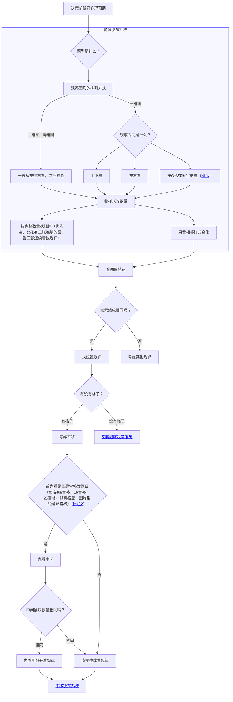

```mermaid
    graph TD
    A["决策前做好心理预期"] --> B{"题型是什么？"}

    subgraph PRE["前置决策系统"]
        direction TB
        B --> C["观察图形的排列方式"]
        C -->|一组图 / 两组图| D["一般从左往右看，然后推论"]
        C -->|三组图| E{"观察方向是什么？"}

        E --> F["上下看"]
        E --> G["左右看"]
        E --> H["按O形或米字形看（<a href='decision-systems/images/figure-reasoning-paths.png'>图示</a>）"]

        D --> J["看样式的数量"]
        F --> J
        G --> J
        H --> J

        J --> M["按完整数量找规律（优先选，比如有三张连续的图，就三张连续着找规律）"]
        J --> N["只看相邻样式变化"]
    end

    M --> O["看图形特征"]
    N --> O

    style PRE fill:#f7f7ff,stroke:#6c63ff,stroke-width:2px

    O --> P{"元素组成相同吗？"}
    P -->|是| Q["找位置规律"]
    P -->|否| R["考虑其他规律"]

    Q --> S{"有没有格子？"}
    S -->|有格子| T["考虑平移"]
    S -->|没有格子| ROTATE_LINK["<a href='decision-systems/rotate-flip-decision-system.md'>旋转翻转决策系统</a>"]

    T --> V{"首先看是否是宫格类题目（宫格有9宫格，16宫格，25宫格、蜂窝格登，图片里的是16宫格）（<a href='images/figure-reasoning-grid-example.png'>附注2</a>）"}
    V -->|是| W["先看中间"]
    V -->|否| AD["直接整体看规律"]

    W --> X{"中间黑块数量相同吗？"}
    X -->|相同| Y["内外圈分开看规律"]
    X -->|不同| AD
    Y --> MOVE_LINK["<a href='decision-systems/move-decision-system.md'>平移决策系统</a>"]
    AD --> MOVE_LINK

```
